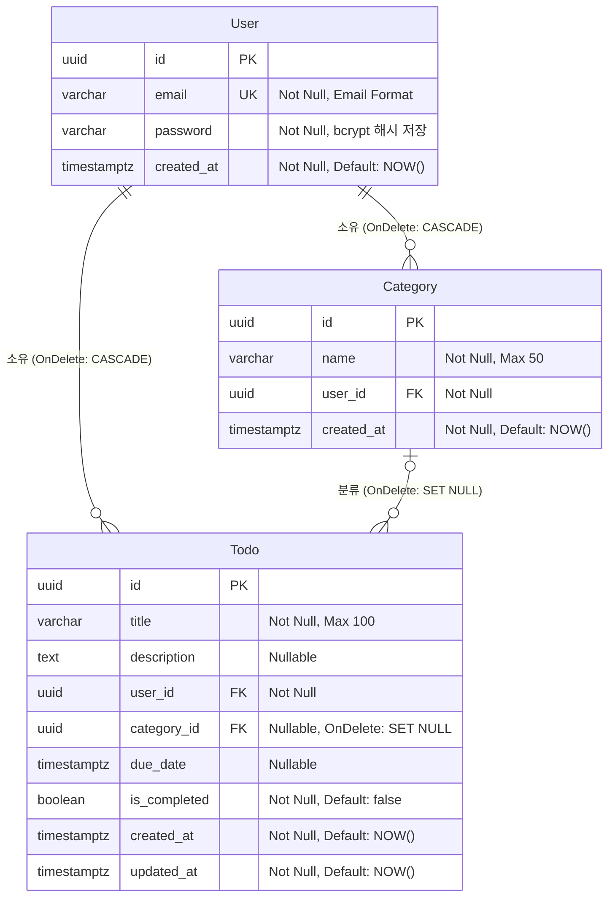

# ERD (Entity Relationship Diagram) — TodoList

**버전:** 1.0  
**작성일:** 2026-04-28  
**참조 문서:** 1-domain-definition.md v0.3, 2-prd.md v1.0

---

## 변경 이력

| 버전 | 날짜 | 작성자 | 변경 내용 |
|---|---|---|---|
| 1.0 | 2026-04-28 | Chanok | 초안 작성 |

---

## 1. ERD 전체 다이어그램



---

## 2. 관계 상세

| 관계 | 카디널리티 | FK 컬럼 | 삭제 정책 | 비고 |
|---|---|---|---|---|
| User → Todo | 1 : N | `Todo.user_id` | CASCADE | 사용자 삭제 시 할일 전체 삭제 |
| User → Category | 1 : N | `Category.user_id` | CASCADE | 사용자 삭제 시 카테고리 전체 삭제 |
| Category → Todo | 0..1 : N | `Todo.category_id` | SET NULL | 카테고리 삭제 시 할일 보존, category_id = null |

---

## 3. 제약조건 및 인덱스

```sql
-- User
CREATE UNIQUE INDEX idx_user_email
    ON users (email);

-- Category: 동일 사용자 내 카테고리 이름 중복 방지 (DR-05)
CREATE UNIQUE INDEX idx_category_user_name
    ON categories (user_id, name);

-- Todo: 사용자별 조회 성능
CREATE INDEX idx_todo_user_id
    ON todos (user_id);

-- Todo: 카테고리별 필터링 성능
CREATE INDEX idx_todo_category_id
    ON todos (category_id);

-- Todo: 상태 필터링 성능 (is_completed + due_date 복합)
CREATE INDEX idx_todo_status_filter
    ON todos (user_id, is_completed, due_date);
```

---

## 4. 할일 상태 계산 로직 (DB 컬럼 아님)

`status` 는 DB에 저장되지 않으며 조회 시점에 아래 로직으로 계산됩니다.

```
is_completed = true              → 완료
is_completed = false, due_date IS NULL   → 진행 중  (DR-07)
is_completed = false, due_date > NOW()   → 진행 중
is_completed = false, due_date ≤ NOW()   → 기간 초과
```

---

## 5. PostgreSQL 타입 매핑

| 도메인 타입 | PostgreSQL 타입 | 비고 |
|---|---|---|
| UUID | `uuid` | `gen_random_uuid()` 기본값 권장 |
| String | `varchar(n)` | n = 최대 길이 |
| Text | `text` | 길이 제한 없음 |
| DateTime | `timestamptz` | 타임존 포함 저장 |
| Boolean | `boolean` | `true` / `false` |
