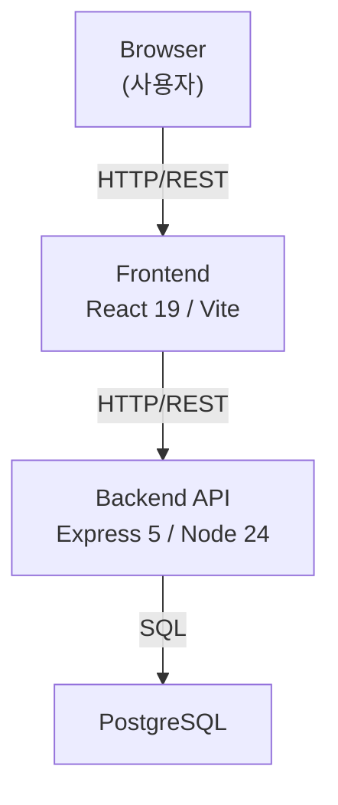
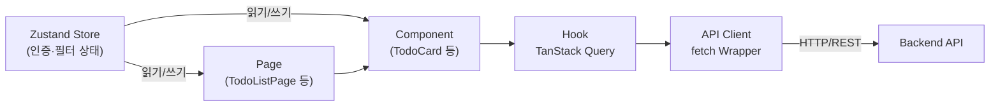
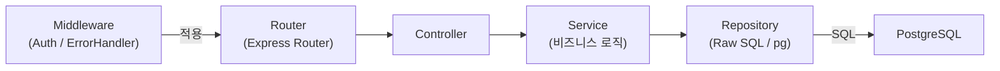
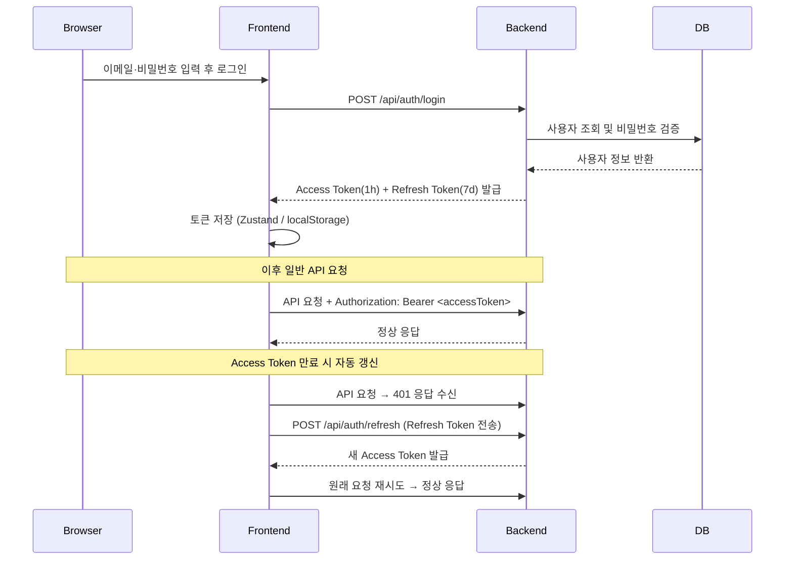
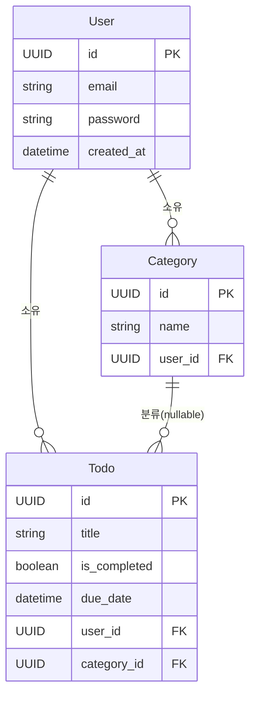

# 기술 아키텍처 다이어그램 — TodoList

**버전:** 1.0  
**작성일:** 2026-04-28  
**참조 문서:** 2-prd.md v1.0, 3-project-structure.md v1.0

---

## 변경 이력

| 버전 | 날짜 | 작성자 | 변경 내용 |
|---|---|---|---|
| 1.0 | 2026-04-28 | Chanok | 초안 작성 |

---

## 1. 시스템 전체 구조

---

## 2. Frontend 레이어 구조

---

## 3. Backend 레이어 구조

---

## 4. 인증 흐름

---

## 5. 핵심 도메인 엔티티 관계

